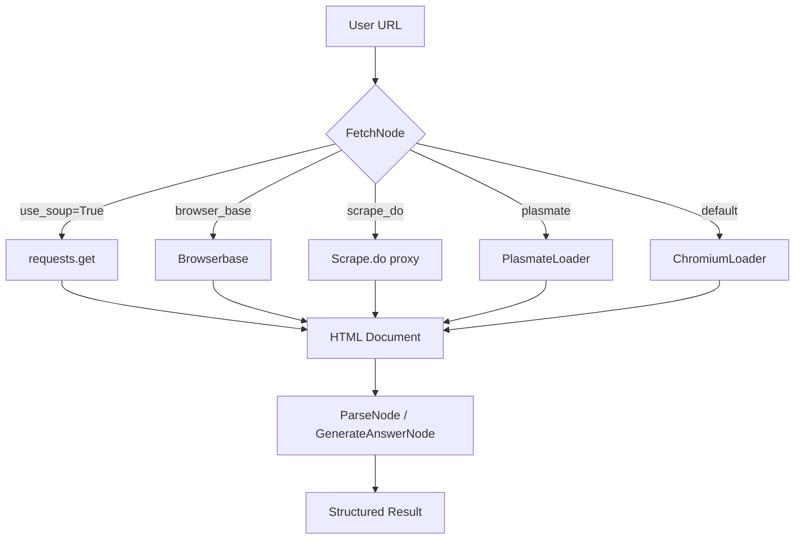

# Anti-Blocking Guide: Reliable Web Access with ScrapeGraphAI

> This guide explains how to use ScrapeGraphAI to programmatically access web pages without getting blocked, obtain raw HTML, interact with page elements, and bypass common anti-bot controls. A mandatory security section is included so users understand the risk surface before using these techniques.

---

## TABLE OF CONTENTS

1. [Project Information](#project-information)
2. [Overview](#overview)
3. [Prerequisites](#prerequisites)
4. [Installation](#installation)
5. [Quick Start](#quick-start)
6. [Configuration](#configuration)
7. [Usage](#usage)
8. [Output](#output)
9. [Troubleshooting](#troubleshooting)
10. [Architecture](#architecture)
11. [Security Considerations](#security-considerations)
12. [License](#license)
13. [Version Information](#version-information)

---

## PROJECT INFORMATION

**Document:** Anti-Blocking Guide for ScrapeGraphAI
**Scope:** Programmatic web access, HTML extraction, element interaction, bot-check bypass
**Audience:** Developers, QA engineers, data engineers

---

## OVERVIEW

### Purpose

This document shows how to use ScrapeGraphAI loaders and graph nodes to fetch web pages reliably, render JavaScript-heavy pages, obtain raw HTML, interact with DOM elements, and bypass common anti-bot protections. It also surfaces the security trade-offs of these techniques.

### Key Features

- Fetch web pages through `FetchNode`, `ChromiumLoader`, `PlasmateLoader`, and `ScrapeDoLoader`.
- Obtain raw HTML or Markdown-converted content.
- Interact with rendered DOM through Playwright/Selenium-backed loaders.
- Use proxy rotation, browser-based fetching, and headless modes to bypass bot checks.
- Structured output via LLM pipelines for data extraction.

### Target Audience

Developers and engineers building scraping pipelines, QA engineers automating browser flows, and data engineers extracting structured data from protected sites.

### Use Case Examples

- Programmatic access to a product page and extraction of price data without being blocked.
- Headless browsing of a SPA to obtain fully rendered HTML.
- Interaction with HTML elements (form fill, click, scroll) before extraction.
- Multi-page crawling through search results with rotation and retry.

### Process Overview

The anti-blocking workflow has three phases: (1) setup loaders and transport, (2) fetch with anti-bot controls, (3) extract or interact with page content.

---

## PREREQUISITES

### Required Software

| Software | Version | Purpose |
|----------|---------|---------|
| Python | 3.12+ | Runtime |
| Playwright | 1.57.0+ | Browser automation backend |
| Chromium | Latest | Browser binary for Playwright |
| Scrape.do account | - | Optional proxy rotation service |
| Plasmate binary | Latest | Optional lightweight fetcher |

### Required Accounts/Credentials

- Scrape.do API token: required only if using the Scrape.do loader.
- LLM API key: required only if using LLM-based extraction (`SmartScraperGraph`, `SearchGraph`).

### System Requirements

- **Operating System**: Linux, macOS, or Windows with WSL recommended for Playwright.
- **RAM**: 2 GB minimum; 4 GB recommended for headless browser workloads.
- **Storage**: 1 GB for Playwright browser binaries.

### Environment Variables

```bash
# Disable default telemetry (recommended before any scraping)
export SCRAPEGRAPHAI_TELEMETRY_ENABLED=false

# Optional LLM credentials
export OPENAI_API_KEY=...
export ANTHROPIC_API_KEY=...

# Optional Scrape.do credentials
export SCRAPE_DO_API_KEY=...
```

---

## INSTALLATION

```bash
# Install the package
pip install scrapegraphai

# Install Playwright browser binaries
playwright install

# Optional: install Plasmate
pip install plasmate
```

---

## QUICK START

### Minimal Setup: obtain HTML from a URL

```python
from scrapegraphai.graphs import SmartScraperGraph

graph_config = {
    "llm": {
        "model": "openai/gpt-4o-mini",
        "api_key": "YOUR_OPENAI_API_KEY",
    },
    "headless": True,
    "verbose": False,
}

scraper = SmartScraperGraph(
    prompt="Extract the page title and main text.",
    source="https://example.com",
    config=graph_config,
)

result = scraper.run()
print(result)
```

### Expected Output

```json
{
  "title": "Example Domain",
  "main_text": "..."
}
```

---

## CONFIGURATION

### Loader Selection

ScrapeGraphAI supports multiple loaders. Choose based on the target site and anti-bot complexity:

| Loader | Class | Best for |
|--------|-------|----------|
| ChromiumLoader | `scrapegraphai.docloaders.chromium.ChromiumLoader` | JavaScript-heavy pages requiring DOM rendering. |
| PlasmateLoader | `scrapegraphai.docloaders.plasmate.PlasmateLoader` | Lightweight fetcher with lower resource footprint. |
| ScrapeDoLoader | `scrapegraphai.docloaders.scrape_do.scrape_do_fetch` | Proxy rotation and geo-rotation through Scrape.do. |

### Anti-Blocking Options

| Option | Location | Effect |
|--------|----------|--------|
| `headless` | Graph/node config | Run browser without UI; set `False` during debugging. |
| `loader_kwargs` | Node config | Forwarded to Playwright/Selenium (proxy, storage state, timeouts). |
| `proxy` | Node config | Proxy rotation through `loader_kwargs.proxy`. |
| `storage_state` | Node config | Reuse authenticated browser session to avoid repeated bot checks. |
| `timeout` | Node config | Request timeout in seconds; default 30 for fetches, 480 for LLM calls. |
| `use_soup` | FetchNode config | Use `requests.get` instead of a browser; faster but more detectable. |
| `browser_base` | FetchNode config | Use Browserbase service for managed browsing. |
| `scrape_do` | FetchNode config | Use Scrape.do proxy service for IP rotation. |

---

## USAGE

### Pattern 1: Obtain raw HTML via `SmartScraperGraph`

```python
from scrapegraphai.graphs import SmartScraperGraph

config = {
    "llm": {"model": "openai/gpt-4o-mini", "api_key": "..."},
    "headless": True,
    "loader_kwargs": {
        "proxy": {"server": "http://proxy.example:8080"},
    },
    "timeout": 30,
}

scraper = SmartScraperGraph(
    prompt="Return the entire page content as text.",
    source="https://target.example.com",
    config=config,
)

result = scraper.run()
raw_html = result  # structured output from LLM
```

### Pattern 2: Obtain raw HTML via `FetchNode` directly

```python
from scrapegraphai.nodes import FetchNode
from scrapegraphai.graphs import BaseGraph

fetch = FetchNode(
    input="url",
    output=["doc"],
    node_config={
        "headless": True,
        "loader_kwargs": {"proxy": {"server": "http://proxy:8080"}},
        "timeout": 30,
    },
)

graph = BaseGraph(
    nodes=[fetch],
    edges=[],
    entry_point=fetch,
    graph_name="FetchOnly",
)

state, _ = graph.execute({"url": "https://target.example.com"})
document = state["doc"][0]
html = document.page_content
metadata = document.metadata
```

### Pattern 3: Interact with HTML elements (Playwright-backed)

Use `FetchNode` with Playwright-specific kwargs to control the browser session. Playwright is invoked through `ChromiumLoader`; any keyword accepted by the underlying loader can be passed through `loader_kwargs`.

```python
fetch = FetchNode(
    input="url",
    output=["doc"],
    node_config={
        "headless": False,  # visible browser for debugging
        "loader_kwargs": {
            "backend": "playwright",
            "browser_name": "chromium",
            "requires_js_support": True,
            "timeout": 60,
        },
    },
)
```

After `graph.execute(...)`, the loaded `Document.page_content` includes the rendered HTML after JavaScript execution. JavaScript-triggered content, lazy-loaded images, or dynamic forms are therefore available for parsing.

### Pattern 4: Bypass bot checks with proxy rotation and Scrape.do

```python
config = {
    "llm": {"model": "openai/gpt-4o-mini", "api_key": "..."},
    "scrape_do": {
        "api_key": "YOUR_SCRAPE_DO_API_TOKEN",
        "use_proxy": True,
        "geoCode": "US",
        "super_proxy": False,
    },
    "timeout": 30,
}

scraper = SmartScraperGraph(
    prompt="Extract product price.",
    source="https://target.example.com/product/123",
    config=config,
)

result = scraper.run()
```

### Pattern 5: Search engine scraping with rotation

```python
from scrapegraphai.nodes import SearchInternetNode

search_node = SearchInternetNode(
    input="user_prompt",
    output=["search_results"],
    node_config={
        "llm_model": llm,
        "search_engine": "duckduckgo",
        "max_results": 10,
        "loader_kwargs": {"proxy": {"server": "http://proxy:8080"}},
    },
)
```

### Pattern 6: Multi-page scraping with `SearchGraph`

```python
from scrapegraphai.graphs import SearchGraph

config = {
    "llm": {"model": "openai/gpt-4o-mini", "api_key": "..."},
    "headless": True,
    "max_results": 5,
}

scraper = SearchGraph(
    prompt="Find pricing pages for CRM software.",
    source="https://example.com",
    config=config,
)

result = scraper.run()
```

### Important Considerations

- **Playwright browser footprint**: `ChromiumLoader` launches a full browser process. Ensure system memory and CPU are sufficient for concurrent runs.
- **Headless detection**: Some sites detect headless Chromium via `navigator.webdriver` or missing browser plugins. Toggle `headless` or use `undetected-playwright` if needed.
- **Session reuse**: Pass `storage_state` from a prior authenticated session to avoid CAPTCHA or login prompts on repeated runs.
- **Proxy quality**: Free or low-quality proxies often trigger bot checks. Rotation and geo-matching improve success rates.
- **Respect `robots.txt`**: `scrapegraphai/helpers/robots.py` provides a robots.txt checker. Use it before scraping at scale.
- **Rate limiting**: Use `loader_kwargs` retry and timeout settings, and add delays between requests to avoid IP bans.

---

## OUTPUT

### Output Format

The primary output is a Python `dict` produced by the selected graph. For LLM-based graphs, the structure depends on the prompt and schema. For raw HTML access via `FetchNode`, the output is a `Document` object with `page_content` and `metadata`.

```python
# FetchNode output shape
{
  "doc": [
    Document(
      page_content="<html>...</html>",
      metadata={"source": "https://target.example.com", "loader": "playwright"},
    )
  ]
}
```

### Log Files

Console logging is controlled by `verbose` in the graph config. Set `verbose: True` for node-level execution logs.

---

## TROUBLESHOOTING

### Common Issues

| Issue | Cause | Solution |
|-------|-------|----------|
| ` playwright install` fails | Missing OS dependencies | Run `playwright install-deps` or install libnss3, libatk1.0-0, libatk-bridge2.0-0, libcups2, libdrm2, libxkbcommon0, libxcomposite1, libxdamage1, libxrandr2, libgbm1, libpango-1.0-0, libcairo2, libasound2. |
| Empty `page_content` | JS-heavy page blocked headless | Set `headless: False` during debugging, increase `timeout`, or enable `fallback_to_chrome=True` with `PlasmateLoader`. |
| `Scrape.do` returns 403 or empty | Token/rotation issue | Verify `SCRAPE_DO_API_KEY`, enable `use_proxy`, and set `geoCode`. |
| CAPTCHA persists | IP reputation too low | Switch proxy provider, reduce request rate, or use authenticated sessions via `storage_state`. |
| LLM timeout | Network or prompt too large | Reduce `chunk_size` or increase `timeout`. |

### FAQ

**Q: Can ScrapeGraphAI bypass Cloudflare or Akamai bot management?**
A: No tool guarantees bypass. The library provides transport controls (proxy rotation, browser automation, session reuse) that may help certain cases, but anti-bot vendors continuously update defenses.

**Q: Is headless mode more detectable?**
A: Some bot checks inspect `navigator.webdriver`. Toggling `headless` or using `undetected-playwright` may reduce detection; this is not guaranteed.

**Q: How are secrets handled?**
A: LLM API keys and proxy credentials should be provided via environment variables or configuration files, never hardcoded. See the Security Considerations section.

---

## ARCHITECTURE

### System Design Overview

ScrapeGraphAI is a graph-based scraping library. Graphs are composed of nodes. `FetchNode` handles fetching; `ParseNode` handles chunking; `GenerateAnswerNode` (or related nodes) handles LLM extraction.

### Module Descriptions

| Module | File | Purpose | Key Functions |
|--------|------|---------|---------------|
| FetchNode | `scrapegraphai/nodes/fetch_node.py` | Fetch web or local content into `Document` objects. | `handle_web_source`, `handle_file`, `load_file_content` |
| ChromiumLoader | `scrapegraphai/docloaders/chromium.py` | Playwright/Selenium browser fetcher. | `load`, `ascrape_playwright`, `ascrape_selenium` |
| PlasmateLoader | `scrapegraphai/docloaders/plasmate.py` | Lightweight Rust browser binary fetcher. | `lazy_load`, `alazy_load`, `_fetch_url` |
| Scrape.do helper | `scrapegraphai/docloaders/scrape_do.py` | Proxy rotation through Scrape.do service. | `scrape_do_fetch` |
| ParseNode | `scrapegraphai/nodes/parse_node.py` | Parse HTML into chunks and extract URLs. | `execute`, `_extract_urls` |
| SearchInternetNode | `scrapegraphai/nodes/search_internet_node.py` | Search-engine-backed discovery. | `search_on_web` |

### Data Flow



### Component Relationships

- `AbstractGraph` configures common parameters and propagates them to every node via `set_common_params`.
- `FetchNode` receives the user `source` URL and dispatches to one of four loaders.
- Loaders return LangChain `Document` objects consumed by downstream nodes.
- `ParseNode` splits content into chunks for LLM processing.
- `GenerateAnswerNode` sends chunks to the configured LLM and assembles the final structured output.

---

## SECURITY CONSIDERATIONS

This section documents the security drawbacks and vulnerabilities relevant to the anti-blocking techniques described above. Users must read this section before scraping any site.

### 1. Arbitrary Code Execution via ScriptCreatorGraph

The `ScriptCreatorGraph` / `GenerateCodeNode` accepts LLM-generated Python code and executes it with `exec()` with `__builtins__` present in the sandbox globals. Remote scraped HTML is fed into the LLM prompt, meaning a target webpage can influence the generated code. An attacker who controls the target page can cause arbitrary Python execution on the host running ScrapeGraphAI.

**Affected code path:** `scrapegraphai/nodes/generate_code_node.py:446-466`

**Precaution:** Do not run `ScriptCreatorGraph` against untrusted URLs or in multi-tenant environments. If this feature is required, run it in a sandboxed container or VM with no network/filesystem access and an OS-level seccomp/AppArmor profile.

### 2. SSRF via User-Supplied URLs

`FetchNode.handle_web_source` passes the user-supplied `source` URL directly to `requests.get` when `use_soup=True`, with no SSRF guard, no metadata-IP blocklist, and no redirect restriction. The same pattern recurs in `Scrape.do` and search integrations. An attacker can make the library send HTTP requests to cloud metadata endpoints (`169.254.169.254`), localhost services, or internal network resources.

**Affected code paths:**
- `scrapegraphai/nodes/fetch_node.py:287-289`
- `scrapegraphai/docloaders/scrape_do.py:42-48`
- `scrapegraphai/utils/research_web.py:272-323`

**Precaution:** Validate target URLs against an allowlist or blocklist for internal ranges before fetching. Avoid using the library in environments that expose sensitive internal metadata endpoints.

### 3. Credential Exposure via Scrape.do Query String

When using `Scrape.do` in API mode, the API token is transmitted in the URL query parameter `?token={token}`. This token is exposed in HTTP access logs, proxy logs, and browser network inspection. A leaked token enables unauthorized scraping through the victim's account.

**Affected code path:** `scrapegraphai/docloaders/scrape_do.py:47-48`

**Precaution:** Prefer Scrape.do proxy mode (`use_proxy=True`) which authenticates with the token in the proxy URL rather than the query string. Rotate tokens frequently and monitor usage for anomalies.

### 4. Disabled TLS Verification for Scrape.do Proxy Path

`urllib3.disable_warnings(urllib3.exceptions.InsecureRequestWarning)` is called at import time in `scrape_do.py`, and the proxy-mode fetch uses `verify=False`. This silently accepts any TLS certificate, enabling man-in-the-middle attacks on proxy communications and scraped content.

**Affected code path:** `scrapegraphai/docloaders/scrape_do.py:11, 42-44`

**Precaution:** Do not rely on TLS protections when using `Scrape.do` proxy mode through this library. Consider terminating TLS at a trusted reverse proxy if end-to-end TLS is required.

### 5. Default Opt-Out Telemetry

Telemetry is enabled by default. The payload sent to `https://sgai-oss-tracing.onrender.com/v1/telemetry` includes the user prompt, JSON schema, scraped website content, and LLM response. Opt-out requires explicitly setting `SCRAPEGRAPHAI_TELEMETRY_ENABLED=false`.

**Affected code path:** `scrapegraphai/telemetry/telemetry.py:58-142`

**Precaution:** Set `SCRAPEGRAPHAI_TELEMETRY_ENABLED=false` in the environment before importing or using the library. Do not scrape proprietary, PII-containing, or confidential content with the library unless telemetry has been explicitly disabled and verified.

### 6. Dynamic Backend Import via User-Configurable `backend`

`ChromiumLoader` accepts a `backend` parameter (default `playwright`) and passes it to `dynamic_import()`, which calls `importlib.import_module(modname)`. If an attacker can control the graph configuration, they could force loading of an arbitrary module, leading to code execution at import time.

**Affected code paths:**
- `scrapegraphai/docloaders/chromium.py:62`
- `scrapegraphai/utils/sys_dynamic_import.py:59-64`

**Precaution:** Do not instantiate `ChromiumLoader` or graph configurations from untrusted JSON/YAML input. Validate `backend` against an explicit allowlist (`playwright`, `selenium`) if dynamic configuration is required.

### 7. Unbounded Condition Evaluation from Graph Config

`ConditionalNode._evaluate_condition` evaluates arbitrary expression strings via `simple_eval` with a namespace that includes the entire graph state. An attacker who controls the graph configuration can embed expressions that read internal state keys or cause denial of service.

**Affected code path:** `scrapegraphai/nodes/conditional_node.py:86-107`

**Precaution:** Do not load graph configurations from untrusted sources. Restrict `ConditionalNode` usage to known-safe boolean keys or a whitelist of expressions.

---

## LICENSE

MIT License. See the `LICENSE` file in the project root for details.

---

## VERSION INFORMATION

*Document Version: 1.0.0*
*Last Updated: 2026-06-20*
*Package Version: 2.0.0*
*Template Reference: .agent/skills/documentation-architect/assets/readme-template.md*
*Rules Reference: .agent/rules/readme-rules.md*
